<p align="center">
  
</p>

<h1 align="center">Varity SDK</h1>

<p align="center">
  <strong>Build, deploy, and monetize production apps — 70% cheaper than AWS</strong>
</p>

<p align="center">
  Auth, database, storage, and payments included. One command to deploy. Zero configuration.
</p>

<p align="center">
  <a href="https://www.npmjs.com/package/@varity-labs/sdk"></a>
  <a href="https://pypi.org/project/varitykit/"></a>
  <a href="https://github.com/varity-labs/varity-sdk/blob/main/LICENSE"></a>
  <a href="https://discord.gg/varity"></a>
  <a href="https://github.com/varity-labs/varity-sdk/stargazers"></a>
</p>

<p align="center">
  <a href="https://docs.varity.so">Documentation</a> ·
  <a href="https://docs.varity.so/getting-started/quickstart">Quick Start</a> ·
  <a href="https://store.varity.so">App Store</a> ·
  <a href="https://discord.gg/varity">Discord</a>
</p>

<p align="center">
  <code>npx create-varity-app my-app</code>
</p>

<p align="center">
  
</p>

---

## Why Varity?

Most platforms make you stitch together auth, database, storage, payments, and hosting yourself. Varity includes everything in the box.

| | AWS | Vercel | Supabase + Vercel | **Varity** |
|---|---|---|---|---|
| **Time to deploy** | 30+ min | 5 min | 10 min | **60 seconds** |
| **Auth included** | No | No | Yes | **Yes** |
| **Database included** | No | No | Yes | **Yes** |
| **Storage included** | No | No | Yes | **Yes** |
| **Payments included** | No | No | No | **Yes** |
| **App Store listing** | No | No | No | **Yes** |
| **Cost (100 users + AI)** | ~$2,800/mo | ~$400/mo | ~$350/mo | **~$800/mo** |

You build. You deploy. Users find your app. You get paid. That's it.

## Quick Start

### Option 1: npx (recommended)

```bash
npx create-varity-app my-app
cd my-app
npm run dev
```

### Option 2: CLI

```bash
pip install varitykit
varitykit init my-app
cd my-app
npm install
npm run dev
```

### Deploy

```bash
pip install varitykit   # if not already installed
varitykit app deploy
# => Live at https://my-app.varity.app
```

**3 commands from zero to production.**

## What You Get Out of the Box

### Authentication (email, Google, GitHub — zero setup)

```tsx
import { PrivyStack, PrivyLoginButton, usePrivy } from '@varity-labs/ui-kit';

function App() {
  return (
    <PrivyStack appId={process.env.NEXT_PUBLIC_VARITY_APP_ID}>
      <PrivyLoginButton />
    </PrivyStack>
  );
}
```

Users can sign in with email (magic link), Google, GitHub, Discord, and more. No auth logic to write. No password hashing. No session management.

### Database (zero-config, instant)

```typescript
import { db } from '@varity-labs/sdk';

// Create a collection
const posts = db.collection('posts');

// Add a document (returns the document with id and timestamps)
const post = await posts.add({ title: 'Hello World', author: userId });

// Get all documents (with optional pagination and ordering)
const allPosts = await posts.get();
const recent = await posts.get({ limit: 10, orderBy: '-created_at' });

// Update by ID
await posts.update(post.id, { title: 'Updated Title' });

// Delete by ID
await posts.delete(post.id);
```

Works out of the box. No database setup, no API keys, no configuration.

### Payments (monetize your app instantly)

```tsx
import { PaymentWidget } from '@varity-labs/ui-kit';

<PaymentWidget
  amount={49.99}
  currency="USD"
  onSuccess={(payment) => grantAccess(payment.userId)}
/>
```

Users pay with credit card or Apple Pay. You receive revenue automatically. Varity handles all payment processing.

### 19 Production-Ready UI Components

```tsx
import {
  DashboardLayout,
  DataTable,
  KPICard,
  ConfirmDialog,
  CommandPalette,
  ToastProvider,
  useToast,
  Button,
  Toggle,
  Avatar,
} from '@varity-labs/ui-kit';
```

Dashboard layouts, data tables, analytics cards, modals, form components, and more. All accessible (WCAG 2.1) and compatible with Next.js static export.

## Packages

| Package | Description | Install |
|---------|-------------|---------|
| **[@varity-labs/sdk](packages/core/varity-sdk/)** | Core SDK — database, credentials, zero-config development | `npm i @varity-labs/sdk` |
| **[@varity-labs/ui-kit](packages/ui/varity-ui-kit/)** | 19 React components — auth, dashboards, payments, data tables | `npm i @varity-labs/ui-kit` |
| **[@varity-labs/types](packages/core/varity-types/)** | TypeScript type definitions for all Varity interfaces | `npm i @varity-labs/types` |
| **[create-varity-app](packages/cli/create-varity-app/)** | Scaffold a new app in one command | `npx create-varity-app` |
| **[varitykit](cli/)** | CLI — init, deploy, manage apps | `pip install varitykit` |
| **[@varity-labs/mcp](packages/cli/varity-mcp/)** | MCP Server — use Varity from Cursor, Claude Code, and 10+ AI tools | `npx @varity-labs/mcp` |

## Works with Your AI Tools

Varity works inside **Cursor**, **Claude Code**, **VS Code Copilot**, **ChatGPT**, **Windsurf**, and 8+ AI coding tools via the [Model Context Protocol](https://modelcontextprotocol.io).

Say **"deploy this to Varity"** in your AI editor and your app is live. Zero commands.

<details>
<summary><strong>Cursor</strong> — add to <code>.cursor/mcp.json</code></summary>

```json
{
  "mcpServers": {
    "varity": {
      "command": "npx",
      "args": ["@varity-labs/mcp"]
    }
  }
}
```

</details>

<details>
<summary><strong>Claude Code</strong></summary>

```bash
claude mcp add varity -- npx @varity-labs/mcp
```

</details>

<details>
<summary><strong>VS Code with Copilot</strong></summary>

Command Palette → **MCP: Add Server** → Command (stdio) → `npx @varity-labs/mcp`

</details>

<details>
<summary><strong>Any MCP-compatible client</strong></summary>

```json
{
  "mcpServers": {
    "varity": {
      "command": "npx",
      "args": ["@varity-labs/mcp"]
    }
  }
}
```

</details>

**7 AI-powered tools:** search docs, calculate costs, create apps, deploy, check status, read logs, submit to App Store — all from natural language.

## Templates

### SaaS Starter (Production-Ready)

```bash
varitykit init my-saas --template saas-starter
```

Includes:
- Landing page with animations and social proof
- Authentication (login, signup, protected routes)
- Dashboard with sidebar navigation
- Settings page with theme customization
- Data tables with CSV export
- Toast notifications
- Command palette (Cmd+K)
- Mobile-responsive layout
- 4 color theme presets

Built with Next.js 15, Tailwind CSS, and TypeScript.

## CLI Reference

```bash
varitykit doctor              # Check your environment
varitykit init <name>         # Create a new app
varitykit app deploy          # Deploy your app
varitykit app deploy --submit-to-store   # Deploy and list on the Varity App Store
```

[Full CLI documentation →](https://docs.varity.so/cli/overview)

## Deploy and Earn

Every app deployed through Varity can be listed on the **[Varity App Store](https://store.varity.so)** — a marketplace where users discover and pay for apps.

**Revenue split: 90% to you, 10% to Varity.**

```bash
# Deploy and submit to the App Store in one command
varitykit app deploy --submit-to-store
```

Set your price. Users pay with credit card. You get paid monthly. No Stripe setup, no payment pages, no invoicing.

## Cost Comparison

| What You're Running | AWS | Varity | You Save |
|---------------------|-----|--------|----------|
| SaaS app (100 users) | ~$2,800/mo | ~$800/mo | **~70%** |
| Storage (1 TB) | ~$230/mo | ~$23/mo | **~90%** |
| Compute | ~$500/mo | ~$150/mo | **~70%** |
| Database | ~$300/mo | ~$50/mo | **~83%** |

Cost savings come from decentralized infrastructure providers that compete on price instead of charging cloud premiums.

## Architecture

```
┌─────────────────────────────────────────────────────┐
│  Your App (Next.js, React, any framework)           │
├─────────────────────────────────────────────────────┤
│  @varity-labs/ui-kit    │  @varity-labs/sdk         │
│  - Auth components      │  - Database               │
│  - Payment widgets      │  - Credentials            │
│  - Dashboard layouts    │  - Payments               │
│  - 19 components        │  - Zero-config dev        │
├─────────────────────────────────────────────────────┤
│  varitykit CLI                                      │
│  - Init / Deploy / Manage / Submit to Store         │
├─────────────────────────────────────────────────────┤
│  Infrastructure (fully managed — you never touch)   │
│  - Hosting    - Auth     - Database    - Storage    │
└─────────────────────────────────────────────────────┘
```

## Documentation

| Resource | Link |
|----------|------|
| Full Documentation | [docs.varity.so](https://docs.varity.so) |
| Quick Start (5 min) | [Getting Started](https://docs.varity.so/getting-started/quickstart) |
| Next.js Guide | [Next.js Quick Start](https://docs.varity.so/getting-started/quickstart-nextjs) |
| Auth Guide | [Authentication](https://docs.varity.so/build/auth/quickstart) |
| Database Guide | [Database Quick Start](https://docs.varity.so/build/databases/quickstart) |
| Storage Guide | [Storage Quick Start](https://docs.varity.so/build/storage/quickstart) |
| Payments Guide | [Payments Quick Start](https://docs.varity.so/build/payments/quickstart) |
| CLI Reference | [CLI Overview](https://docs.varity.so/cli/overview) |

## Community

- **Discord** — [discord.gg/varity](https://discord.gg/varity) — ask questions, share what you're building, get help
- **GitHub Issues** — bug reports and feature requests
- **Twitter/X** — [@VarityLabs](https://twitter.com/VarityLabs)

## Contributing

We welcome contributions from everyone. Whether it's a bug fix, a new component, improved docs, or a feature request — we appreciate it.

```bash
# Clone the repo
git clone https://github.com/varity-labs/varity-sdk.git
cd varity-sdk

# Install dependencies
pnpm install

# Build all packages
pnpm build

# Run tests
pnpm test
```

See [CONTRIBUTING.md](CONTRIBUTING.md) for detailed guidelines.

## Built with Varity

Add a badge to your project's README:

**Built with Varity** (for apps using the SDK):

```markdown
[](https://varity.so)
```

[](https://varity.so)

**Deployed on Varity** (for apps hosted on Varity):

```markdown
[](https://varity.so)
```

[](https://varity.so)

**Shields.io fallback** (works without hosting the repo):

```markdown
[](https://varity.so)
```

## License

MIT — see [LICENSE](LICENSE) for details.

---

<p align="center">
  <strong>Build faster. Deploy cheaper. Get paid.</strong>
</p>

<p align="center">
  <a href="https://docs.varity.so/getting-started/quickstart">Get started in 5 minutes →</a>
</p>

<p align="center">
  If Varity helps you build, consider giving us a star — it helps others find the project.
</p>
